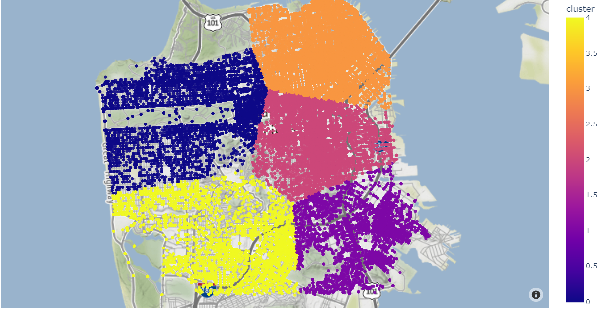

# SAN FRANCISCO CRIME GEOGRAPHICAL CLUSTERING

## About the Project

Hello there! Welcome to the "SAN FRANCISCO CRIME GEOGRAPHICAL CLUSTERING" project. In this project, I have implemented clustering techniques to analyze and visualize crime data in San Francisco. The main goal is to identify geographical clusters of crimes and create an interactive map to display the results.

## Dataset

For this project, I have used a publicly available dataset containing historical crime data from San Francisco. The dataset includes information about the type of crime, its location, and the date of occurrence. This data forms the basis for the geographical clustering analysis.

## Clustering Techniques

To perform the geographical clustering, I have utilized popular clustering algorithms such as K-Means and DBSCAN. These algorithms group similar crime occurrences based on their geographical coordinates, allowing us to discover high-crime density areas or crime hotspots in the city.

## Map Visualization

One of the exciting aspects of this project is the interactive map visualization. Using tools like Leaflet and Mapbox, I have created a dynamic map that displays the identified crime clusters with intuitive markers and pop-ups. You can interact with the map to explore different clusters and crime details.

## How to Use

To run the project and visualize the results, follow these steps:

1. Clone the Repository: Clone this repository to your local machine.

2. Install Required Dependencies: Make sure you have installed all the necessary libraries and packages specified in the requirements.txt file.

3. Run the Code: Execute the main script to perform the clustering analysis and generate the interactive map.

4. Explore the Map: Open the generated map in your web browser and start exploring the crime clusters in San Francisco.

## Contribution

I am continuously working to improve this project and make it more useful. If you have any suggestions, improvements, or new ideas to contribute, please don't hesitate to open an issue or submit a pull request. Your contributions are highly appreciated!

## License

This project is open-source and licensed under the MIT License. For more details, please see the "LICENSE" file.
